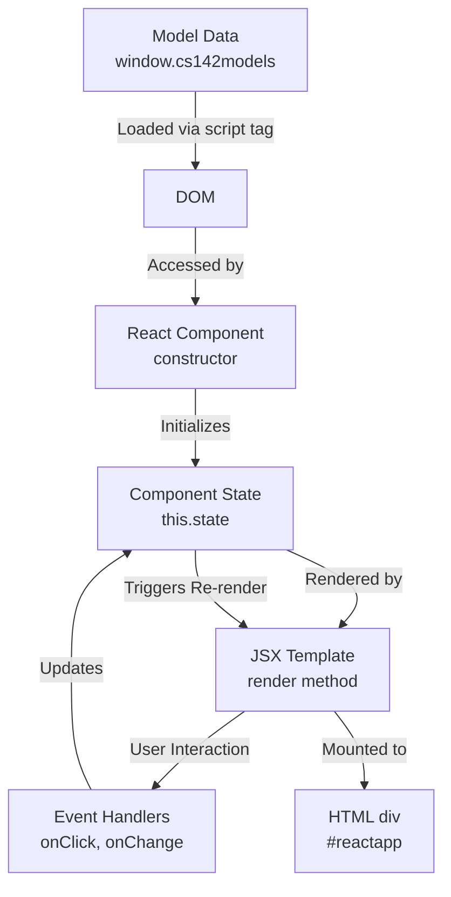

# Setup

We can use npm to run the various tools we had it fetch. As can be seen in the "scripts" property of the package.json file, the following run commands are available:

- `npm run build` 
  Runs Webpack using the configuration file `webpack.config.js` to package all of the project's JSX files into a single JavaScript bundle in the directory compiled.
- `npm run build:w `
  Runs Webpack like the npm run build command except it invokes webpack with --watch, so it will monitor the React components and regenerate the bundle if any of them change. This option is useful for development so changes made to components can be picked up by simply refreshing the browser to load the newly updated bundle. Otherwise, you would need to remember to run npm run build after every change. You might get a deprecation warning [DEP_WEBPACK_WATCH_WITHOUT_CALLBACK] that you can safely ignore.
- `npm run lint`
  Runs ESLint on all the project's JavaScript files. The code you submit should run ESLint without warnings.

# Target
This project uses ReactJS, a popular framework for building web applications. The project's goal is to get you enough up to speed with ReactJS and the CS142 coding conventions that you will be able to build a web application with it in the next project.

In order to fetch our web app via the HTTP protocol, we use a simple Node.js web server that can be started with this command from the project4 directory:
`node webServer.js`

All the files in the project4 can be fetched using an URL starting with http://localhost:3000. Click on http://localhost:3000 to verify your web server is running. It should serve the file index.html to your browser.

We recommend you configure your development environment to run webpack in watch mode, which means you will need to run the node webserver (`node webServer.js`) and webpack (`npm run build:w`) when building and testing your project. You could do this by running the programs in different command line tabs or windows. Syntax errors get detected and reported by Babel, so the output of webpack is useful.


# Getting Started
In this project we require that you use **the model, view, controller pattern** described in class. 

## Code Structure
There are many ways of organizing code under this pattern so we provide an example that both demonstrates some basic ReactJS features as well as showing the file system layout and module pattern we would like you to follow in your projects.

### The HTML in `getting-started.html` 
You should start by opening the example in your browser by navigating to the URL http://localhost:3000/getting-started.html. The page displays examples of ReactJS in action. 
The HTML in `getting-started.html` provides a `<div>` for ReactJS to draw the app into and a script tag include the app's JavaScript bundle compiled/gettingStarted.bundle.js. 

### The webpack config
The webpack config file `webpack.config.js` directs that this bundle be created from the ReactJS file `gettingStarted.jsx`, a JSX program that renders the ReactJS component named Example into the `<div>` in getting-started.html.

### ReactJS reusable components
To support reusable components, we adopt a file organization that co-locates the ReactJS component and its associated CSS stylesheet in a subdirectory of a directory named `components`. 
The Example component is located in the files `components/Example/{index.jsx,styles.css}`.

You should look through the files invoked in the getting-started.html view (getting-started.html, gettingStarted.jsx, components/Example/{index.jsx}) since it shows the JavaScript and JSX statements needed to run an ReactJS web application along with explanatory comments. 

You should use this pattern and file naming convention for the other components you build for the class.

### Model data
Model data is typically fetched from the webserver which retrieves the data from a database. To avoid having to set up a database for this project we will give you an HTML script tag to load the model data directly into the browser's DOM from the local file system. 

The models will appear in the DOM under the property name cs142models. 

You will be able to access it under the name `window.cs142models` in a ReactJS component.


# CS142 Project 4 - Complete Architecture Analysis

## 📋 Executive Summary

This is a **Stanford CS142 JavaScript Applications** project designed to teach **React.js fundamentals**. It's a learning project that demonstrates component-based architecture using the **Model-View-Controller (MVC)** pattern.

---

## 🏗️ 1. Architecture Overview

### High-Level Architecture Diagram

```
┌─────────────────────────────────────────────────────────────┐
│                        Browser                              │
│  ┌──────────────┐  ┌──────────────┐  ┌──────────────┐      │
│  │   HTML Pages │  │  React Apps  │  │ Model Data   │      │
│  │  (Views)     │  │  (Components)│  │  (JSON/JS)   │      │
│  └──────┬───────┘  └──────┬───────┘  └──────┬───────┘      │
│         │                 │                 │               │
│         └─────────────────┴─────────────────┘               │
│                           │                                 │
└───────────────────────────┼─────────────────────────────────┘
                            │ HTTP
┌───────────────────────────┼─────────────────────────────────┐
│                    Node.js Server                           │
│                  (Express.js Static)                        │
│                                                             │
│            Serves: HTML, CSS, JS, Assets                    │
└─────────────────────────────────────────────────────────────┘
```

### File Structure Breakdown

```
project4/
├── 📄 Entry Points (HTML + JSX)
│   ├── index.html              # Main landing page
│   ├── getting-started.html    # Problem 1 entry point
│   ├── p2.html                 # Problem 2-3 entry point
│   ├── gettingStarted.jsx      # React entry for Problem 1
│   └── p2.jsx                  # React entry for Problem 2-3
│
├── 🧩 Components (MVC - View Layer)
│   ├── components/Example/
│   │   ├── index.jsx           # Main example component
│   │   └── styles.css          # Component-specific styles
│   └── components/States/
│       ├── index.jsx           # States display component
│       └── styles.css          # Component-specific styles
│
├── 💾 Model Data (MVC - Model Layer)
│   ├── modelData/
│   │   ├── example.js          # Mock data for Example component
│   │   └── states.js           # Mock data for States component
│   └── README.md               # Model documentation
│
├── 🎨 Global Styles (MVC - View Styling)
│   └── styles/main.css         # Application-wide CSS
│
├── ⚙️ Build & Configuration
│   ├── webpack.config.js       # Bundler configuration
│   ├── package.json            # Dependencies & scripts
│   └── webServer.js            # Express static server
│
└── 📦 Output (Generated)
    └── compiled/
        ├── gettingStarted.bundle.js
        └── p2.bundle.js
```

---

## 🔄 2. How Components Interact

### Data Flow Pattern



### Component Communication Flow

**Example**: 
[Example](file://e:\projects\webapp\cs142_projects\project4\components\Example\index.jsx#L17-L402) Component Lifecycle

1. **Load Phase**
   ```javascript
   // getting-started.html loads model data
   <script src="modelData/example.js"></script>
   
   // gettingStarted.jsx mounts React component
   ReactDOM.render(<Example />, document.getElementById('reactapp'));
   
   // Example.jsx constructor reads model
   this.state = {
       name: window.cs142models.exampleModel().name+
   };
   ```

2. **Mount Phase**
   ```javascript
   componentDidMount() {
       // Start timer, initialize Prism syntax highlighter
       this.timerID = setInterval(counterIncrFunc, 2000);
       Prism.highlightAll();
   }
   ```

3. **Update Phase**
   ```javascript
   handleChange(event) {
       this.setState({ inputValue: event.target.value });
       // Triggers automatic re-render
   }
   ```

4. **Unmount Phase**
   ```javascript
   componentWillUnmount() {
       clearInterval(this.timerID);
   }
   ```

---

## 🎯 3. Design Patterns Identified

### Pattern 1: **MVC (Model-View-Controller)**

| Layer | Implementation | Files |
|-------|---------------|-------|
| **Model** | Global `window.cs142models` object | `modelData/*.js` |
| **View** | React Components (JSX) | `components/*/index.jsx` |
| **Controller** | Event handlers + state management | Component methods |

**How it works:**
```javascript
// MODEL (modelData/example.js)
cs142models.exampleModel = function() {
    return { name: "Unknown Name" };
};

// VIEW (components/Example/index.jsx)
render() {
    return <p>My name is "{this.state.name}"</p>;
}

// CONTROLLER (Component methods)
handleChange(event) {
    this.setState({ inputValue: event.target.value });
}
```

### Pattern 2: **Component-Based Architecture**

Each component is **self-contained** with:
- Own state (`this.state`)
- Own lifecycle methods
- Own styles (co-located CSS)
- Clear props interface

### Pattern 3: **One-Way Data Binding**

```javascript
// Data flows DOWN from parent to child via props
<Child value={this.state.value} />

// Events flow UP from child to parent via callbacks
<button onClick={() => this.handleClick()} />
```

### Pattern 4: **Static File Server Pattern**

```javascript
// webServer.js - Simple Express static server
app.use(express.static(__dirname));
// Serves all files in project4 directory
```

### Pattern 5: **Bundle-Based Deployment**

```javascript
// webpack.config.js - Multiple entry points
entry: {
    gettingStarted: "./gettingStarted.jsx",
    p2: "./p2.jsx",
}
// Outputs: compiled/[name].bundle.js
```

---

## 🔍 4. Code Quality Review

### ✅ Strengths

| Aspect | Rating | Notes |
|--------|--------|-------|
| **Component Separation** | ⭐⭐⭐⭐⭐ | Clean co-location of JSX + CSS |
| **Lifecycle Management** | ⭐⭐⭐⭐⭐ | Proper cleanup in [componentWillUnmount](file://e:\projects\webapp\cs142_projects\project4\components\Example\index.jsx#L60-L64) |
| **State Management** | ⭐⭐⭐⭐ | Immutable updates with `slice()` |
| **Code Comments** | ⭐⭐⭐⭐⭐ | Extensive educational comments |
| **Accessibility** | ⭐⭐⭐⭐ | Uses `htmlFor`, proper labels |


## 📊 Summary Table

| Category | Current Status | Recommendation | Priority |
|----------|---------------|----------------|----------|
| **Architecture** | MVC with class components | Migrate to hooks + functional components | Medium |
| **State Management** | Local component state | Consider Redux for complex state | Low |
| **Security** | Basic input handling | Add sanitization + CSP | High |
| **Performance** | Timer always running | Implement visibility detection | Medium |
| **Type Safety** | None | Add PropTypes or TypeScript | High |
| **Testing** | No tests | Add Jest + React Testing Library | High |
| **Build System** | Webpack (good) | Add HMR for better DX | Medium |
| **Code Quality** | Well-commented | Add ESLint strict rules | Medium |

---

## 🎓 Learning Outcomes

This project effectively teaches:

✅ React component lifecycle  
✅ JSX syntax and templating  
✅ Event handling patterns  
✅ State management basics  
✅ Component composition  
✅ Build tooling (Webpack + Babel)  

**Overall Grade:** ⭐⭐⭐⭐ (4/5) - Excellent educational project with room for modernization

---

# Problem 1: Understand and update the example view (5 points)
You should look through and understand the `getting-started.html` view and the Example component. To demonstrate your understanding do the following:

1. Update the model data for the Example component to use your name rather than "Unknown name". You should find where "Unknown name" is and replace it.
2. Replace the contents of the `div` region with the class `motto-update` in the Example component with some JSX statements that display your name and a short (up to 20 characters) motto. Like the user's name, the initial value for motto should come in with the model data. You must include some styling for this display in styles.css.
3. Extend the display you did in the previous step so it allows the user to update the motto being displayed. The default value should continue to be retrieved from the model data.


## How `window.cs142models` works:


1. **Global Variable Creation**: The model files (`example.js` and `states.js`) define a global variable `cs142models` that gets automatically attached to the `window` object in browsers.

2. **Script Loading Order**: In the HTML files (like `getting-started.html`), the model data scripts are loaded **before** the React application:
   ```html
   <!-- Insert the model data for the Example component into the DOM -->
   <script src="modelData/example.js"></script>
   ```
   
3. **Global Object Structure**: Each model file follows this pattern:
   - Checks if `cs142models` already exists, creates it if not
   - Adds a method to the `cs142models` object that returns the model data
   
   For example, in `example.js`:
   ```javascript
   var cs142models;
   if (cs142models === undefined) {
     cs142models = {};
   }
   cs142models.exampleModel = function () {
     return { name: "Unknown Name" };
   };
   ```

4. **Automatic Window Attachment**: Since these variables are declared globally (without `let`, `const`, or inside a module), they automatically become properties of the global `window` object in browsers.

5. **React Component Access**: The React components can then access this data via `window.cs142models.exampleModel()` because by the time the React code runs, the model scripts have already executed and populated the global object.

This is a simple way to provide mock data for a frontend-only application without needing a backend API. The data is essentially "baked into" the HTML page through script tags, making it immediately available to the JavaScript application.