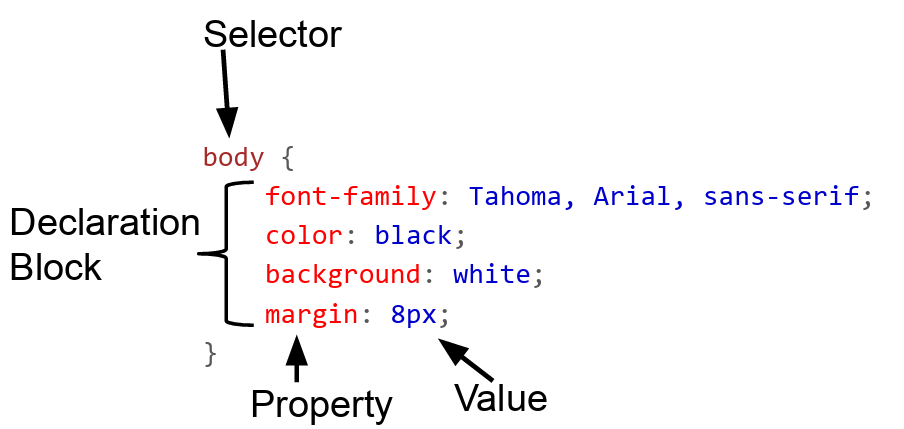
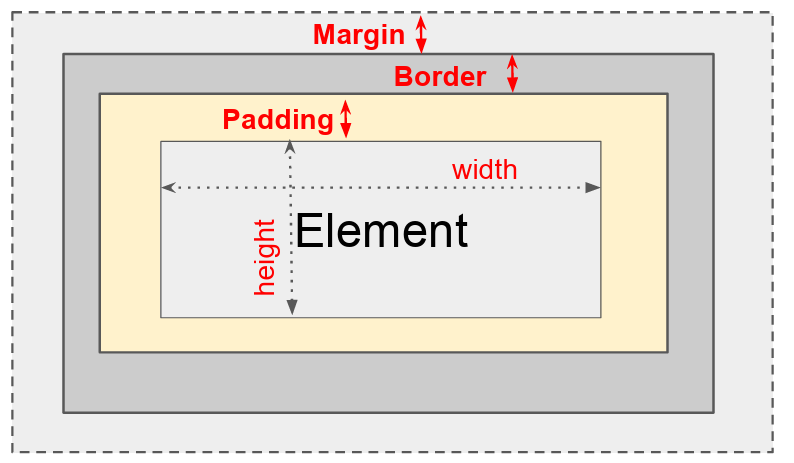
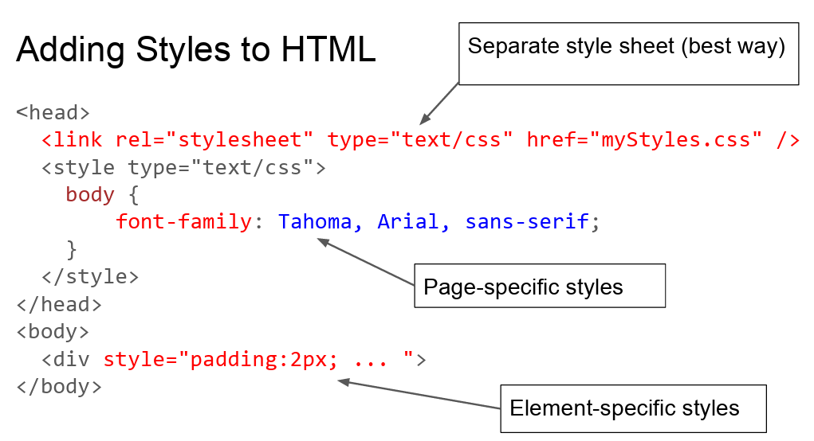

# Cascading Style Sheets (CSS)

## Style sheets were added to address this:

- Specify style to use rather than browser default
- Not have to code styling on every element

## Key concept: Separate style from content

- Content (what to display) is in HTML files
- Formatting information (how to display it) is in separate style sheets (.css files).
- Use an element attribute named `class` to link (e.g. `<span class="test">`)
- Result: define style information once, use in many places
  - Consider can you make all the text in the app slightly bigger?
  - Or purple is our new company color.

## DRY principle: Don't Repeat Yourself

## Style sheet contain one or more CSS Rules



| CSS Selector Type | CSS Rule                      | HTML Example                |
| :---------------- | :---------------------------- | :-------------------------- |
| Tag name          | `h1 { color: red; }`          | `<h1>Today's Specials</h1>` |
| Class attribute   | `.large { font-size: 16pt; }` | `<p class="large">...`      |
| Tag and Class     | `p.large {...}`               | `<p class="large">...`      |
| Element id        | `#p20 { font-weight: bold; }` | `<p id="p20">...`           |

### CSS Pseudo Selectors

hover - Apply rule when mouse is over element (e.g. tooltip)
```css
p:hover, a:hover {
background-color: yellow;
}
```

a:link, a:visited - Apply rule when link has been visited or not visited (link)
```css
a:link {color: blue; }

a:visited { color: green; }
```


## CSS Properties 
Control many style properties of an element: 
- Coloring 
- Size 
- Position 
- Visibility 
- Many more: (e.g. `p: { text-decoration: line-through; }`) 
- Also used in animation

### Color - Properties: color & background_color


Must ultimately turn into red, green, and blue intensities between 0 and 255: 
- Predefined names: red, blue, green, white, etc. (140 standard names)
- 8-bit hexadecimal numbers for red, green, blue: #ff0000
- 0-255 decimal intensities: rgb(255,255,0)
- Percentage intensities: rgb(80%,80%,100%)


## CSS Box Model




Total element width = width + left padding + right padding + left border + right border + left margin + right margin

Margin & Padding Transparent

## CSS distance units

Here is the CSS distance units information rewritten as a Markdown table:

| Category | Example | Description |
| :--- | :--- | :--- |
| **Absolute** | `2px` | pixels |
| **Absolute** | `1mm` | millimeters |
| **Absolute** | `2cm` | centimeters |
| **Absolute** | `0.2in` | inches |
| **Absolute** | `3pt` | printer point (1/72 inch) |
| **Relative** | `2em` | 2 times the element's current font size |
| **Relative** | `3rem` | 3 times the root element's current font size |


## Size Properties - Element, pad, margin, border 
- width       - Override element defaults 
- height            
- padding-top 
- padding-right 
- padding-bottom 
- padding-left 
- margin-top 
- margin-right 
- margin-bottom 
- margin-left
- border-bottom-color 
- border-bottom-style 
- border-bottom-width 
- border-left-color 
- border-left-style 
- border-left-width 
- border-right-color 
- border-right-style 
- border-right-width 
  etc.


## Position property 
Fixed position (0,0) is top left corner
|Position property | Description|
|:-----------------|:-----------|
|position: static; |(default) - Position in document flow|
|position: relative; |  Position relative to default position via  top, right, bottom , and left properties|
|position: fixed;   | Position to a fixed location on the screen via top, right, bottom , and left properties|
 position: absolute; | Position relative to ancestor  absolute element via top, right, bottom , and left properties |


## Some more common properties
- background-image: image for element's background 
- background-repeat: should background image be displayed in a repeating pattern (versus once only) 
- font, font-family, font-size, font-weight, font-style: font information for text 
- text-align, vertical-align: Alignment: center, left, right 
- cursor - Set the cursor when over element (e.g. help)


## Element visibility control properties 
- display:  none;   - Element is not displayed and takes no space in layout. 
- display: inline; - Element is treated as an inline element. 
- display: block; - Element is treated as a block element. 
- display: flex;  - Element is treated as a flex container. 
- display: grid;  - Element is treated as a grid container. 
- visibility: hidden; - Element is hidden but space still allocated. 
- visibility: visible; - Element is normally displayed

## Flexbox and Grid layout 
-  display: flex; (Flexbox) 
-  display: grid; (Grid) newer layout method 
   -  Items flex to fill additional space and shrink to fit into smaller spaces. 
   -  Useful for web app layout: 
       -  Divide up the available space equally among a bunch of elements 
       -  Align of different sizes easily 
       -  Key to handling different window and display sizes 
-  Flexbox - Layout one dimension (row or column) of elements 
-  Grid - Layout in two dimensions (rows and columns) of elements 
-  Covered in discussion section
-  

## Some other CSS issues 
- Inheritance 
  - Some properties (e.g. font-size) are inherited from parent elements 
  - Others (border, background) are not inherited. 
- Multiple rule matches 
  - General idea: most specific rule wins


## Adding Styles to HTML
- Separate style sheet (best way)
- Page-specific styles
- Element-specific styles
  



## CSS in the real world 
- CSS preprocessors (e.g. less) are commonly used 
  - Add variable and functions to help in maintaining large collections of style sheets 
  - Apply scoping using the naming conventions 
- Composition is a problem 
  - It can be really hard to figure out what rule from which stylesheet is messing things up
