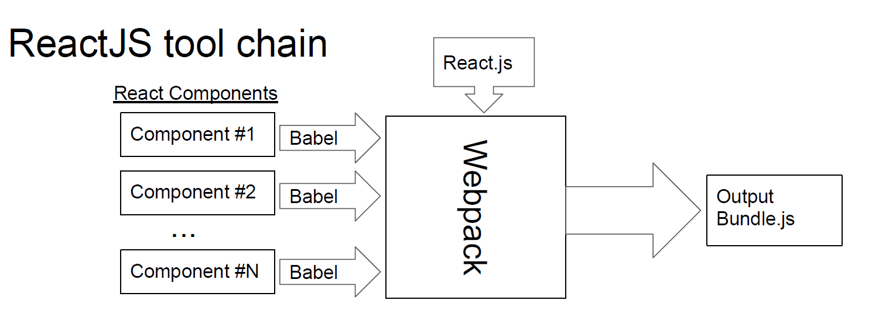
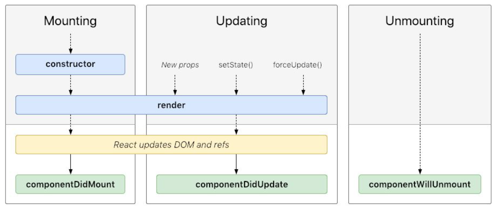
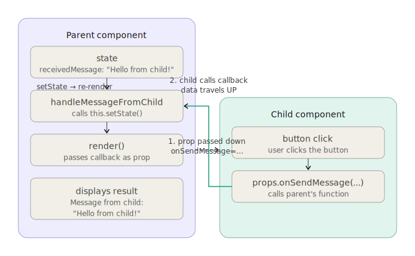

# CS142 Lecture Notes - ReactJS Introduction

_Mendel Rosenblum_

- [react-lifecycle-methods-diagram](http://projects.wojtekmaj.pl/react-lifecycle-methods-diagram/)
- [react.dev](https://react.dev/)
- [react.dev/learn](https://react.dev/learn)
- [legacy reactjs docs](https://reactjs.org/docs/context.html)
- [legacy reactjs-tutorial](https://legacy.reactjs.org/tutorial/tutorial.html)
- [w3schools-react](https://www.w3schools.com/react/react_getstarted.asp)

---

## ReactJS Overview

### What is ReactJS?

ReactJS is a JavaScript framework for building web applications that run in the browser. Unlike server-rendered apps, React gives you snappy, app-like responsiveness without full page reloads.

- JavaScript framework for writing web applications
  - Like AngularJS — **snappy** response from running in browser
  - Less opinionated: only specifies rendering the view and handling user interactions
- Uses **Model-View-Controller** pattern
  - View constructed from Components using pattern
  - Optional, but commonly used, HTML templating
- Minimal server-side support dictated
- Focus on supporting programming in the large and single-page applications
  - Modules, reusable components, testing, etc.

---

### The HTML entry point: ReactJS Web Application Page

Every React app starts with a plain HTML file. React injects its entire UI into a single div — the rest is JavaScript.

```html
<!doctype html>
<html>
  <head>
    <title>CS142 Example</title>
  </head>
  <body>
    <div id="reactapp"></div>
    <script src="./webpackOutput/reactApp.bundle.js"></script>
  </body>
</html>
```

- The div with id="reactapp" is the mount point. React writes the entire application view into this single element.
- ReactJS applications come as a **JavaScript blob** that will use the DOM interface to write the view into the `div`.

---

### ReactJS Tool Chain


| Tool | Purpose |
|------|---------|
| **Babel** | Transpile language features (e.g. ECMAScript, JSX) to basic JavaScript |
| **Webpack** | Bundle modules and resources (CSS, images) — output loadable with a single `<script>` tag in any browser |

## React Components

### ES6 Class Definition

A React component class(or React component type) is an ES6 class that extends `React.Component`. Every component must have a `render()` method that returns a tree of React elements.

- A component takes in parameters, called `props` (short for “properties”), and returns a hierarchy of views to display via the `render` method.
- The `render` method returns a description of what you want to see on the screen. React takes the description and displays the result. In particular, render returns a `React element`, which is a lightweight description of what to render.
- Most React developers use a special syntax called “JSX” which makes these structures easier to write.

```js
// components/ReactAppView.js
import React from 'react';


class ReactAppView extends React.Component {  // Inherits from `React.Component`
  constructor(props) {
    super(props); // `props` is set to the attributes passed to the component
    ...
  }

  render() { ... } // Requires method `render()`:it describes what to show — returns the React element tree of the component's view
}

export default ReactAppView;
```

---

#### ReactAppView with `render()` Method

```js
render() {
  let label = React.createElement('label', null, 'Name: ');
  let input = React.createElement('input',
    { type: 'text', value: this.state.yourName,
      onChange: (event) => this.handleChange(event) });
  let h1 = React.createElement('h1', null,
    'Hello ', this.state.yourName, '!');
  return React.createElement('div', null, label, input, h1);
}
```

Returns an element tree with a `div` containing `label`, `input`, and `h1` elements:

```html
<div>
  <label>Name: </label>
  <input type="text" … />
  <h1>Hello {this.state.yourName}!</h1>
</div>
```

---

#### ReactAppView `render()` Without Intermediate Variables

```js
render() {
  return React.createElement('div', null,
    React.createElement('label', null, 'Name: '),
    React.createElement('input',
      { type: 'text', value: this.state.yourName,
        onChange: (event) => this.handleChange(event) }),
    React.createElement('h1', null,
      'Hello ', this.state.yourName, '!')
  );
}
```

#### Using JSX to Generate `createElement` Calls

- JSX makes building the element tree look like templated HTML-like syntax directly embedded in JavaScript.
- Babel compiles it to React.createElement() calls automatically.— so the output is identical to the previous slide.
- The browser never sees JSX — only plain JavaScript.

### JSX: the readable shorthand


- 
```jsx
render() {
  return (
    <div>
      <label>Name: </label>
      <input
        type="text"
        value={this.state.yourName}
        onChange={(event) => this.handleChange(event)}
      />
      <h1>Hello {this.state.yourName}!</h1>
    </div>
  );
}
```

---

### React.createElement under the hood

Before JSX, you created elements by calling `React.createElement(type, props, ...children)` directly. Understanding this helps you understand what JSX compiles to.


```js
React.createElement(type, props, ...children);
```

| Parameter  | Description                                                        |
| ---------- | ------------------------------------------------------------------ |
| `type`     | HTML tag (e.g. `h1`, `p`) or `React.Component`                     |
| `props`    | Attributes object (or null) (e.g. `type="text"`). Uses **camelCase**!               |
| `children` | nested elements or text, Zero or more: strings/numbers, React elements, or arrays of either |

---


```js
render() {
  return React.createElement(
    'div', null,
    React.createElement('label', null, 'Name: '),
    React.createElement('input',
      { type: 'text', value: this.state.yourName }),
    React.createElement('h1', null,
      'Hello ', this.state.yourName, '!')
  );
}
```

### Rendering into the DOM

To mount your root component into the HTML page, you call `ReactDOM.render()`. This is the bridge between React's virtual world and the real browser DOM.

### Old way (React 17 and below):

```js
// reactApp.js — Render Element into Browser DOM
import React from "react"; // **ES6 Modules** — bring in React and web app React components
import ReactDOM from "react-dom";
import ReactAppView from "./components/ReactAppView";

let viewTree = React.createElement(ReactAppView, null);
let where = document.getElementById("reactapp");
ReactDOM.render(viewTree, where); //Renders the tree of React elements into the browser's DOM at the `div` with `id="reactapp"`
```

#### Modern React 18+ rendering

```js
import React from "react";
import ReactDOM from "react-dom/client"; // ← note: /client subpath
let appView = React.createElement(ReactAppView, null);
const app = document.getElementById("reactapp");
const root = ReactDOM.createRoot(app);
root.render(appView);
```

---

## State & Events

### Component State and Input Handling

State is a component's private, mutable data. Initialize it in the constructor and update it with `this.setState()`. React automatically re-renders when state changes.

- Input calls `setState()`, which causes React to call `render()` again
- Never mutate `this.state` directly (e.g. this.state.yourName = 'x'). Always use setState() so React knows to re-render.

```js
import React from "react";

class ReactAppView extends React.Component {
  constructor(props) {
    super(props);
    this.state = { yourName: "" }; //Makes `<h1>Hello {this.state.yourName}!</h1>` update reactively
  }

  handleChange(event) {
    this.setState({ yourName: event.target.value }); // setState() triggers React's reconciliation: it updates the state object and calls render() again with the new values.
  }
}
```

#### Why `event.target.value`?

When the user types in the input box, the browser fires a DOM event. That event object has a specific structure:

```
event                        ← KeyboardEvent object
  │
  ├── event.type             → "keydown", "keyup", or "keypress"
  ├── event.key              → "Enter", "a", "Escape", "ArrowDown", etc.
  ├── event.code             → "KeyA", "Enter", "Escape", "ArrowDown", etc.
  └── event.target           ← the DOM element that triggered the event
        │                       (the <input> box itself)
        │
        ├── event.target.type      → "text"
        ├── event.target.name      → ""
        ├── event.target.id        → ""
        └── event.target.value     → "A"  ← what the user typed
  ├── event.shiftKey         → true/false (was Shift pressed?)
  ├── event.ctrlKey          → true/false (was Ctrl pressed?)
  ├── event.altKey           → true/false (was Alt pressed?)
  └── event.metaKey          → true/false (was Meta/Command pressed?)


```

So `event.target` is the `<input>` element, and `.value` is whatever text is currently inside it. When the user types "A", `event.target.value === "A"`. When they type "An", `event.target.value === "An"`, and so on.

This is why `handleChange` uses it to update state:

```javascript
handleChange(event) {
  this.setState({
    yourName: event.target.value   // grab what's in the input box
  });                              // and save it into state
}
```

The full one-way data binding loop looks like this:

```
User types "A" into <input>
        ↓
onChange fires → handleChange(event) called
        ↓
event.target         = the <input> DOM element
event.target.value   = "A"   (what the user typed)
        ↓
this.setState({ yourName: "A" })
        ↓
React re-renders → <h1>Hello A!</h1>
        ↓
input value={this.state.yourName} → input shows "A"
```

---

A quick comparison of what you could read from `event` and why `.target.value` is the right choice for an input:

| Expression             | What it gives you       | Useful for                              |
| ---------------------- | ----------------------- | --------------------------------------- |
| `event`                | The whole event object  | Rarely needed directly                  |
| `event.type`           | `"change"`              | Knowing which event fired               |
| `event.target`         | The `<input>` DOM node  | Accessing element properties            |
| `event.target.value`   | `"A"` — the text typed  | Reading input content                   |
| `event.target.checked` | `true/false`            | Checkboxes and radio buttons            |
| `event.target.name`    | The `name=""` attribute | Handling multiple inputs in one handler |

For a text input, `event.target.value` is always the right thing to read.

---

### One-Way Data Binding

React uses **one-way binding**: data flows from state into the view, and user input flows back through event handlers. This predictable loop makes debugging much easier.

React only re-renders what actually changed in the virtual DOM. This makes updates very fast even for complex UIs.

```
1. User Typing 'D' in the Input Box -> JSX `onChange` fires -> triggers `handleChange` with `event.target.value === "D"`
2. `handleChange` calls `this.setState({ yourName: event.target.value })`
   - `this.state.yourName` is changed to `"D"`
3. React sees state change and calls `render()` again
4. The h1 now shows 'Hello D!' — Feature of React: **highly efficient re-rendering**
```

---

### The 'this' problem with event handlers

When you pass a method reference, the browser calls it without the correct 'this' context. Binding ensures 'this' always refers to the component instance.

Calling React Components from Events: A Problem Passing a method as an event handler breaks the this context.

This does **not** work — `this` context is lost when passed as a callback:

Understand Why doesn't onChange={this.handleChange} work without binding?

```jsx
<input type="text" value={this.state.yourName} onChange={this.handleChange} />
```

When you pass a method reference, the browser calls it without the correct 'this' context. Binding ensures 'this' always refers to the component instance.

---

There are three standard workarounds.

#### Workaround #1 — Bind in Constructor

```js
class ReactAppView extends React.Component {
  constructor(props) {
    super(props);
    this.state = { yourName: "" };
    this.handleChange = this.handleChange.bind(this); //Create instance function bound to instance, Safe and explicit. Best for class components.
  }

  handleChange(event) {
    this.setState({ yourName: event.target.value });
  }
}
```

---

#### Workaround #2 — Class Field Arrow Function

```js
class ReactAppView extends React.Component {
  constructor(props) {
    super(props);
    this.state = { yourName: "" };
  }

  handleChange = (event) => {
    //Using public fields of classes with arrow functions. Automatic binding. Cleanest syntax.
    this.setState({ yourName: event.target.value });
  };
}
```

---

#### Workaround #3 — Arrow Function in JSX

```js
class ReactAppView extends React.Component {
  handleChange(event) {
    this.setState({ yourName: event.target.value });
  }

  render() {
    return (
      <input
        type="text"
        value={this.state.yourName}
        // Using arrow functions in JSX
        //Creates a new function on each render — OK for most cases.
        onChange={(event) => this.handleChange(event)}
      />
    );
  }
}
```

---

## JSX 
JSX lets you write HTML-like syntax directly in JavaScript. 
JSX is run as a preprocessor to the HTML-like language to JavaScript. The generated JavaScipt is limited to calls to the React.js  `createElement`  function which allow us to write something that looks like HTML to describe what the component renders.


### camelCase vs. dash-case
Although JSX looks like HTML, it is not HTML. Some of the differences are necessary due to embeddding in JavaScript. 

HTML attributes are `case-insensitive`, but JavaScript is not. JSX is embedded in JavaScript, so React uses `camelCase` for all attributes.

- HTML is **case-insensitive**, JavaScript is **case-sensitive**
- ReactJS's JSX has HTML-like syntax embedded in JavaScript
  - HTML attribute : onclick, onchange, class, tabindex
  - JSX attribute : onClick, onChange, className, tabIndex
- **ReactJS rule**: use `camelCase` for attributes (e.g. `onChange`, `onClick`)
- AngularJS used both: dashes in HTML and camelCase in JavaScript
- Use `className=` instead of `class=` to avoid conflict with the JavaScript `class` keyword. Same for `htmlFor=` instead of `for=`.

---

### JSX rules: expressions only

- Inside `JSX curly braces {}`, you can only use expressions — things that evaluate to a value. 
- JavaScript statements like `let`,`if` and `for` don't work.
- The ternary operator `(? :)` is an expression — it evaluates to a value. if/for/let are statements and cannot appear directly in JSX.

```js
// Valid: expression
<div>{foo}</div>
<div>{count + 1}</div>

// Invalid: 'if' is a statement, not an expression
<div>{if (flag) { ... }}</div>

// Workaround: ternary
<div>{flag ? <A/> : <B/>}</div>

// Workaround: IIFE (immediately-invoked function)
<div>{ (function() {
  if (...) return <A/>;
  return <B/>;
})() }</div>
```

---

### Template substitution

JSX treats text inside of parentheses (e.g. {JavaScriptExpression}) as templates where the JavaScript expression is evaluated in the context of the current function and whose value replaces the template in the string. The expression can evaluate to a JavaScript string or value from a JSX expression. This feature allows component's specification to use templated HTML.

JSX Templates Must Return a Valid `children` Param


Valid — variables and expressions in scope:

```jsx
<div>{foo}</div>
<div>{foo + 'S' + computeEndingString()}</div>
```

Invalid — `if` and `for` are statements, not expressions:

```jsx
<div>{if (useSpanish) { … }}</div>  // Does not work
```

Workaround — anonymous immediately-invoked function:

```jsx
<div>{ (function() { if …; for ..; return val; })() }</div>
```

---
### One-way binding from JavaScript to HTML

React automatically propagates any changes to JavaScript state to the JSX templates. 

For example the following code (`{this.state.counter}`) displays the state.counter property of the Example component. The component sets a timer that increments the counter every 2 seconds. The value of the counter can be seen changing here: 2384.

### Control flow
#### Conditional Render in JSX

Since JSX requires expressions, there are two clean patterns for conditional rendering.

Pattern 1: **Using the ternary operator:**

```jsx
<div>{this.state.useSpanish ? <b>Hola</b> : "Hello"}</div>
```

Pattern 2: **Using a JavaScript variable:**
more readable for complex logic

```js
let greeting;
const en = "Hello";
const sp = <b>Hola</b>;
let { useSpanish } = this.props;

if (useSpanish) {
  greeting = sp;
} else {
  greeting = en;
}
```

```jsx
<div>{greeting}</div>
```

---

#### Iteration in JSX

To render a list of items, use .map() to transform an array into an array of JSX elements. Always include a key= prop for efficiency.

The key= prop helps React identify which items changed, improving re-render performance. Keys must be unique among siblings.

**Using a `for` loop:**

```js
let listItems = [];
for (let i = 0; i < data.length; i++) {
  listItems.push(<li key={data[i]}>Data Value {data[i]}</li>);
}
return <ul>{listItems}</ul>;
```

**Using `map` (functional style):**

```jsx
return (
  <ul>
    {data.map((d) => (
      <li key={d}>Data Value {d}</li>
    ))}
  </ul>
);
```

> The key= prop helps React identify which items changed, improving re-render performance. Keys must be unique among siblings.

React uses keys to match elements between renders. Without keys, React may unnecessarily re-create DOM nodes when the list changes.

#### Short-circuit boolean operations
Short-circuit boolean operations such as "&&" can also be used to control what is rendered. For example the following code will make a sentence appear between to two paragraph when some characters are typed into the input box below.

```jsx
<div>
  <p>A paragraph will appear between this paragraph</p>
  {
    this.state.inputValue && (
      <p>This text will appear when this.state.inputValue is truthy.
        this.state.inputValue === {this.state.inputValue}
      </p>
    )
  }
  <p>... and this one when some characters are typed into the input box below.</p>
</div>
```

Generates the output:
```
A paragraph will appear between this paragraph

... and this one when some characters are typed into the below box.
```


### Input using DOM-like handlers

Input in React is done using DOM-like event handlers. For example, JSX statements like:

```jsx
<label htmlFor="inId">Input Field: </label>
<input type="text" value={this.state.inputValue} onChange={this.handleChangeBound} />

```

will display the text from the inputValue property of the Component's state in the input box (it starts out blank) and calls the function this.handleChangedBound every time the input field is changed.
Typically this kind of input will be associated with a Button or inside a Form to allow the user to signal when they are finished changing the input field. 
Note the differences from HTML in onchange= become onChange= andfor= becoming htmlFor=.


### Styling with React/JSX

- React components can import CSS files directly (processed by Webpack).
- Must use `className=` instead of `class=` (conflict with the JS `class` keyword)

```js
import React from "react";

import "./ReactAppView.css";
//Webpack can import CSS style sheets:
// .cs142-code-name {
// font-family: Courier New, monospace;
// }

class ReactAppView extends React.Component {
  render() {
    return (
      <span className="cs142-code-name">
        {" "}
        // Must use className= for HTML class= attribute (JS keyword conflict)
        ...
      </span>
    );
  }
}
```

```css
/* ReactAppView.css */
.cs142-code-name {
  font-family:
    Courier New,
    monospace;
}
```

---

## Component Lifecycle and Methods

[react-lifecycle-methods-diagram](http://projects.wojtekmaj.pl/react-lifecycle-methods-diagram/)


Class components go through three lifecycle phases. React calls specific methods at each phase, giving you hooks to run code at the right moment.

Three phases:

| Phase          | Key Methods                                                                                |
| -------------- | ------------------------------------------------------------------------------------------ |
| **Mounting**   | `constructor` → `render` → `componentDidMount`                                             |
| **Updating**   | `render` → `componentDidUpdate` (triggered by new props, `setState()`, or `forceUpdate()`) |
| **Unmounting** | `componentWillUnmount`                                                                     |

- `componentDidMount` — great for starting timers or fetching data
  `componentDidMount` runs after the component is first added to the DOM — the right place to start timers, fetch data, or set up subscriptions.

- `componentDidUpdate` — runs after every re-render (check what changed!)
- `componentWillUnmount` — clean up timers, subscriptions, listeners

---

### Lifecycle Methods Example — Update UI Every 2 Seconds

```js
class Example extends React.Component {
  componentDidMount() {
    // Start 2 sec counter
    const incFunc = () => this.setState({ counter: this.state.counter + 1 });
    this.timerID = setInterval(incFunc, 2 * 1000);
  }

  componentWillUnmount() {
    // Shutdown timer
    clearInterval(this.timerID);
  }
}
```

---

### Stateless(function) Components

A React component can be a **function** (not a class) if it only depends on `props`:

If a component only depends on props and has no state or lifecycle logic, you can write it as a plain function. Much more concise!

```js
// Class component (verbose)
class MyComponent extends React.Component {
  render() {
    return <div>My name is {this.props.name}</div>;
  }
}

// Function component (concise)
function MyComponent(props) {
  return <div>My name is {props.name}</div>;
}

// With destructuring (even cleaner)
function MyComponent({ name }) {
  return <div>My name is {name}</div>;
}
```

Much more concise than a class with a `render` method.

---

### React Hooks — Add State to Stateless Components

Hooks let function components use state and lifecycle features.

- `useState` adds state;
- `useEffect` replaces lifecycle methods.

Hooks cannot be used inside a class component. useState and useEffect are React Hooks — they only work inside function components.

#### `useState`

- useState Parameter: `initialStateValue` — the initial value of the state
- useState Returns a two-element array: `[currentValue, setterFunction]`
  - 0th element - The current value of the state
  - 1st element - A set function to call (like this.setState)

Example: a bit of state:

```js
const [bit, setBit] = useState(0);
//      ↑      ↑               ↑
//  current  setter       initial value
//   value
```

#### `useEffect`

- useEffect parameter `lifeCycleFunction` is called when something in the dependency array changes
- Replaces lifecycle methods like `componentDidUpdate`

```js
useEffect(lifeCycleFunction, dependencyArray);
```

#### Example

```js
import React, { useState, useEffect } from "react";

function Counter() {
  // [currentValue, setter] = useState(initialValue)
  const [count, setCount] = useState(0);

  // runs after every render where count changes
  // The dependency array [] in useEffect controls when it runs: [] = once on mount, [count] = whenever count changes, omitted = after every render.
  useEffect(() => {
    document.title = `Clicks: ${count}`;
  }, [count]);

  return (
    <button onClick={() => setCount(count + 1)}>Clicked {count} times</button>
  );
}
```

---

### React Hooks Example — `useState`

```js
import React, { useState } from "react";

function Example() {
  const [count, setCount] = useState(0);

  return (
    <div>
      <p>You clicked {count} times</p>
      <button onClick={() => setCount(count + 1)}>Click me</button>
    </div>
  );
}
```

---

### React Hooks Example — `useEffect` Model Fetching

```js
import React, { useState, useEffect } from "react";

function Example() {
  const [count, setCount] = useState(0);
  const [fetched, setFetch] = useState(false);

  useEffect(() => {
    setCount(modelFetch());
    setFetch(true);
  }, [fetched]);

  return (
    <div>
      <p>You clicked {count} times</p>
      <button onClick={() => setCount(count + 1)}>Click me</button>
    </div>
  );
}
```

---

# Communicating Between React Components

**Parent to Child — use `props` (attributes):**

```jsx
// Child reads it via props.param
<ChildComponent param={infoForChildComponent} />

```

**Child to Parent — use callbacks:**

```js
// Parent passes callback.
this.parentCallback = (infoFromChild) => {
  this.setState({ received: infoFromChild });
};

<ChildComponent callback={this.parentCallback} />;

// Child calls it
props.callback("hello from child");
```

**Across the tree — React Context:**
- `React.createContext()` provides a global value to any component in a subtree — avoids prop drilling.
- See: https://reactjs.org/docs/context.html

---

## How Child to Parent — use callbacks
Great question! The example in the notes is a bit incomplete — it skips showing how the parent and child actually fit together. Let me build a complete, concrete example from scratch.

---

### The core idea

In React, data flows **down** via props. But sometimes a child needs to send data **up** to the parent — for example, a child button tells the parent what was clicked. Since you can't pass data upward directly, the parent **passes a function down as a prop**, and the child **calls that function** with the data. The function lives in the parent, so when the child calls it, the parent receives the data.

```
Parent owns the state
    │
    │  passes a function as a prop (the "callback")
    ▼
  Child
    │
    │  calls props.callback("some data")  when something happens
    ▼
Parent's function runs → this.setState() → re-renders with new data
```

---

### Complete working example

Here is the notes' example rewritten as two complete components you can actually run.

**The Parent component:**

```javascript
import React from "react";
import ChildComponent from "./ChildComponent";

class ParentComponent extends React.Component {
  constructor(props) {
    super(props);
    this.state = {
      receivedMessage: "Nothing yet...",  // starts empty
    };
  }

  // Step 1 — Parent defines the callback function
  // This function lives in the parent, so it can call this.setState()
  handleMessageFromChild = (infoFromChild) => {
    this.setState({ receivedMessage: infoFromChild });
  };

  render() {
    return (
      <div>
        <h2>Parent Component</h2>

        {/* Step 2 — Parent passes the callback DOWN as a prop */}
        <ChildComponent onSendMessage={this.handleMessageFromChild} />

        {/* Step 4 — Parent shows the data it received from child */}
        <p>Message from child: <strong>{this.state.receivedMessage}</strong></p>
      </div>
    );
  }
}

export default ParentComponent;
```

**The Child component:**

```javascript
import React from "react";

class ChildComponent extends React.Component {
  handleButtonClick = () => {
    // Step 3 — Child calls the callback with data to send UP
    // props.onSendMessage is the function the parent passed down
    this.props.onSendMessage("Hello from child!");
  };

  render() {
    return (
      <div>
        <h3>Child Component</h3>
        <button onClick={this.handleButtonClick}>
          Send message to parent
        </button>
      </div>
    );
  }
}

export default ChildComponent;
```

---

### Annotated flow0what happens step by step when you click the button

**Step-by-step when you click the button:**

1. Parent defines `handleMessageFromChild` — a function that calls `this.setState()`
2. Parent passes it **down** to child as `onSendMessage={this.handleMessageFromChild}`
3. Child receives it as `this.props.onSendMessage` — the child doesn't own this function, it just holds a reference to it
4. User clicks the button → child calls `this.props.onSendMessage("Hello from child!")`
5. That executes the parent's function with `infoFromChild = "Hello from child!"`
6. Parent calls `this.setState({ receivedMessage: "Hello from child!" })`
7. React re-renders the parent → `<p>` shows the new message

---

### The bug in the original notes

The notes example had a small bug worth pointing out:

```javascript
// BUGGY — notes version
this.parentCallback = (infoFromChild) => {
  this.setState({ received: info });  // ← 'info' is not defined!
};                                    //    should be 'infoFromChild'
```

```javascript
// CORRECT
this.parentCallback = (infoFromChild) => {
  this.setState({ received: infoFromChild });  // ← use the parameter name
};
```

---

### The same thing in modern function components

Since you are learning React today, here is the same pattern using hooks — which is how you would write it in a real project:

```javascript
// Parent (function component)
import React, { useState } from "react";
import ChildComponent from "./ChildComponent";

function ParentComponent() {
  const [receivedMessage, setReceivedMessage] = useState("Nothing yet...");

  // Step 1 — define the callback
  const handleMessageFromChild = (infoFromChild) => {
    setReceivedMessage(infoFromChild);
  };

  return (
    <div>
      <h2>Parent</h2>
      {/* Step 2 — pass it down */}
      <ChildComponent onSendMessage={handleMessageFromChild} />
      <p>Message from child: <strong>{receivedMessage}</strong></p>
    </div>
  );
}
```

```javascript
// Child (function component)
function ChildComponent({ onSendMessage }) {   // destructure the prop directly
  return (
    <div>
      <h3>Child</h3>
      {/* Step 3 — call it with data */}
      <button onClick={() => onSendMessage("Hello from child!")}>
        Send message to parent
      </button>
    </div>
  );
}
```

The pattern is identical — only the syntax changes. The callback is still defined in the parent, passed down as a prop, and called by the child to send data upward.