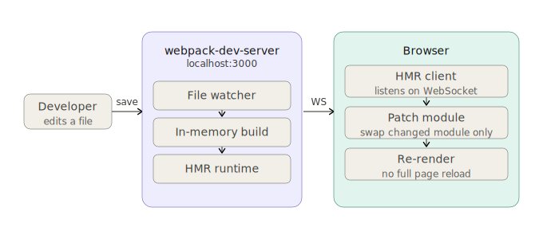

# React JS Tutorial App

A simple React application demonstrating basic React concepts including components, state management, and JSX.

## 📋 Project Structure

```
reactjs_tutorial/
├── public/                 # Static assets and HTML template
│   └── index.html          # Main HTML file (template for HtmlWebpackPlugin)
├── src/                          ← everything lives here
│   ├── index.js                  ← entry point (rename from reactApp.js)
│   ├── App.js                    ← root component
│   ├── components/               ← reusable components
│   │   ├── ReactAppView.js
│   │   └── ReactAppView.css
│   ├── hooks/                    ← custom hooks
│   ├── utils/                    ← helper functions
│   └── assets/                   ← images, fonts, etc.
├── node_modules/           # Dependencies (generated by npm install)
├── dist/                   # Build output (generated by webpack)
├── .babelrc                # Babel configuration for JSX transpilation
├── package.json            # Project metadata and dependencies
├── package-lock.json       # Locked dependency versions
└── webpack.config.js       # Webpack build configuration
```

## 🚀 Getting Started

### Prerequisites

- Node.js (v14 or higher recommended)
- npm (comes with Node.js)

### Installation

1. **Clone or navigate to the project directory:**
   ```bash
   cd tutorials/reactjs_tutorial
   ```

2. **Install dependencies:**
   ```bash
   npm install
   ```

### Development

3. **Start development server with hot reloading:**
   ```bash
   npm start
   ```
   
   This will:
   - Start webpack dev server on `http://localhost:3000`
   - Automatically open your browser
   - Enable hot module replacement (HMR) for instant updates

4. **Alternative: Build in watch mode:**
   ```bash
   npm run dev
   ```
   
   This builds files to the `dist/` folder and watches for changes.

### Production Build

5. **Create production-ready build:**
   ```bash
   npm run build
   ```
   
   Output will be in the `dist/` folder with minified files.

## 🧪 Features Demonstrated

### Core React Concepts

- **Components**: `ReactAppView` class component
- **State Management**: Local component state with `this.state`
- **Event Handling**: Input change handling with `onChange`
- **JSX Syntax**: Modern React syntax with JSX
- **React 18+**: Uses `createRoot` API for modern rendering

### Application Functionality

- Real-time name input field
- Dynamic greeting display: "Hello {name}!"
- Reactive updates using React's state system

## 🛠️ Configuration Files

### Webpack (`webpack.config.js`)
- **Entry Point**: `./src/reactApp.js`
- **Output**: `dist/bundle.js`
- **Loaders**: 
  - `babel-loader` for JavaScript/JSX transpilation
  - `css-loader` and `style-loader` for CSS handling
- **Plugins**: `HtmlWebpackPlugin` for HTML template processing
- **Development Server**: Hot reloading on port 3000

### Babel (`.babelrc`)
- Presets: `@babel/preset-env` and `@babel/preset-react`
- Enables modern JavaScript and JSX syntax

### Package Scripts (`package.json`)
- `start`: Development server with HMR
- `build`: Production build
- `dev`: Watch mode build

## 📁 Key Files

### `public/index.html`
- Template HTML file
- Contains `<div id="reactapp"></div>` mount point
- HtmlWebpackPlugin automatically injects the bundled JavaScript

### `src/reactApp.js`
- Main entry point
- Creates React root using React 18+ `createRoot` API
- Renders `ReactAppView` component wrapped in `React.StrictMode`

### `components/ReactAppView.js`
- Class-based React component
- Manages local state for user input
- Demonstrates controlled components pattern
- Shows JSX rendering with dynamic content

## 🔧 Troubleshooting

### Common Issues

**1. Module not found errors**
```bash
# Solution: Reinstall dependencies
npm install
```

**2. Port 3000 already in use**
- Change port in `webpack.config.js`:
  ```javascript
  devServer: {
    port: 3001, // Use different port
  }
  ```

**3. Build fails with syntax errors**
- Ensure all JSX syntax is correct
- Check that all imports/exports match file paths
- Verify Babel configuration

**4. Component not rendering**
- Check that `index.html` has `<div id="reactapp"></div>`
- Verify component is properly exported and imported
- Check browser console for JavaScript errors

### Debugging Tips

- Open browser developer tools (F12)
- Check Console tab for JavaScript errors
- Check Network tab to verify bundle loading
- Use React Developer Tools browser extension

## 📦 Dependencies

### Runtime Dependencies
- `react`: Core React library (v19.2.4)
- `react-dom`: React DOM renderer (v19.2.4)

### Development Dependencies
- `@babel/core`, `@babel/preset-env`, `@babel/preset-react`: JavaScript transpilation
- `webpack`, `webpack-cli`: Module bundling
- `babel-loader`: Webpack loader for Babel
- `css-loader`, `style-loader`: CSS handling
- `html-webpack-plugin`: HTML template processing

## 🎯 Learning Objectives

This tutorial demonstrates:

✅ React component creation and structure  
✅ State management with class components  
✅ Event handling in React  
✅ Controlled components pattern  
✅ JSX syntax and templating  
✅ Modern React 18+ rendering API  
✅ Webpack build configuration  
✅ Development workflow with hot reloading  

## 📄 License

This project is for educational purposes and learning React fundamentals.

---

**Happy Coding!** 🚀


## The complete pipeline at a glance

Putting it all together end-to-end:

```
You save ReactAppView.jsx
        ↓
  File watcher triggers webpack
        ↓
  babel-loader runs Babel on the file
    • Parses JSX → AST
    • Transforms JSX → React.createElement()
    • Outputs plain ES5 JavaScript
        ↓
  Webpack adds it to the module graph
  (resolves imports, applies other loaders for CSS/images)
        ↓
  [Dev mode]  → In-memory bundle + HMR push to browser
  [Prod build] → dist/bundle.[hash].js + dist/index.html
```

The `webpack.config.js` is the wiring file that connects all of this: it sets the entry point, tells Webpack which loaders to use for which file types, configures the output path, and registers plugins like `HtmlWebpackPlugin`.

### How Babel transpile JSX to JavaScript



JSX has a direct one-to-one mapping to `createElement` calls. Every tag becomes the `type` argument, every attribute becomes a key in the `props` object, and nested content becomes the `children` arguments. The diagram above already shows this — but the key insight is that JSX is just syntactic sugar. There is no JSX at runtime, ever. By the time the browser sees your code, it is pure JavaScript function calls.

`className=` maps to `class` in the DOM, and `onChange=` maps to the browser's `change` event — Babel handles these name translations automatically during the transform step.


Babel is a three-step compiler. 
1. It first **parses** your source into an Abstract Syntax Tree (AST) — a structured, in-memory tree of every token. 
2. Then it **transforms** the tree by applying plugins: `@babel/plugin-transform-react-jsx` walks the tree, finds every JSX node, and replaces it with an equivalent `React.createElement()` call. 
3. Finally it **generates** plain JavaScript from the transformed tree. 
   
  The `.babelrc` file tells Babel which plugins and presets to use — `@babel/preset-env` handles ES6+ syntax, `@babel/preset-react` handles JSX.

---
### How HTML templates are processed



`HtmlWebpackPlugin` takes `public/index.html` as a template and produces `dist/index.html` as output. The critical thing it does is **automatically inject** the `<script src="bundle.[hash].js">` tag — you never hardcode that path yourself. The hash in the filename (`bundle.abc123.js`) is a **content hash**: it changes whenever the bundle content changes, which forces browsers to download the new version instead of serving a stale cached copy. This is called **cache busting**.

---

### How Webpack bundles everything together



Webpack starts at your `entry` file (`index.js`) and follows every `import` statement recursively, building a complete **module dependency graph**. 
For each file type it encounters, it applies a **loader** to transform it into valid JavaScript: 
- `babel-loader` runs Babel on `.js`/`.jsx` files, 
- `css-loader` converts CSS into JS modules, 
- `file-loader` handles images. 
  
Once every module is transformed, Webpack **stitches them all together** into a single `bundle.js` file (or multiple chunks for code splitting). The `HtmlWebpackPlugin` then takes your `public/index.html` template and injects a `<script>` tag pointing to the bundle automatically.

---


### How the development server works


`webpack-dev-server` (or Vite's dev server) runs a local HTTP server and keeps the build **in memory** — it never writes to `dist/` during development, so it's extremely fast. 

It watches your source files for changes. When you save a file, it rebuilds only the affected modules and pushes a tiny update payload to the browser over a **WebSocket** connection. The browser's **HMR (Hot Module Replacement)** client receives the patch and swaps out just the changed module — React components update live without losing application state. This is why you see your UI update instantly without a full page reload.

#### webpack-dev-server vs. Vite's dev server

For a new React project today, Vite is the default recommendation. webpack-dev-server is still widely used in existing projects (especially those using Create React App) and is harder to abandon mid-project, but for a fresh start Vite's developer experience is substantially faster.

---


